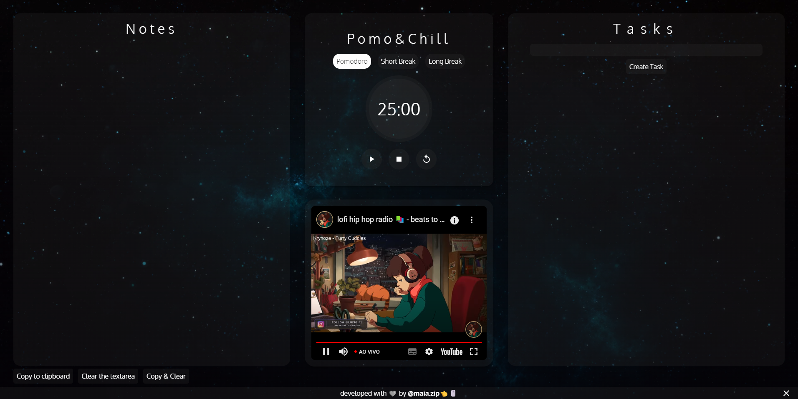

<h1 align="center">Pomo&Chill</h1>

Boost your productivity with Pomo&Chill!

<a href="#projeto">Projeto</a>&nbsp;&nbsp;&nbsp;|&nbsp;&nbsp;
<a href="#tecnologias">Tecnologias</a>&nbsp;&nbsp;&nbsp;|&nbsp;&nbsp;
<a href="#contato">Contato</a>

[Link para acesso](https://maiazip.github.io/Pomo-Chill/)

## Projeto
The project was made to improve the user's productivity, with the help of many features, including a pomodoro timer, a space to take notes, a tasks system using localstorage and music!

## Tecnologias

- HTML
- CSS
- JavaScript
- Git
- Github
## Contato

maia.zip@hotmail.com