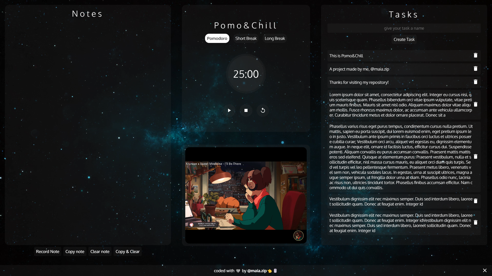
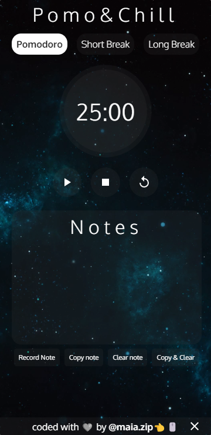

<h1 align="center">Pomo&Chill</h1>

Boost your productivity with Pomo&Chill!

<a href="#project">Project</a>&nbsp;&nbsp;&nbsp;|&nbsp;&nbsp;
<a href="#technologies">Technologies</a>&nbsp;&nbsp;&nbsp;|&nbsp;&nbsp;
<a href="#contact">Contact</a>

[Access Link](https://maiazip.github.io/Pomo-Chill/)

## Project
The project was made to improve the user's productivity, with the help of many features, including a pomodoro timer, a space to take notes, a tasks system using localstorage and music!

## Technologies

- HTML
- CSS
- JavaScript
- Git
- Github
## Contact

maia.zip@hotmail.com