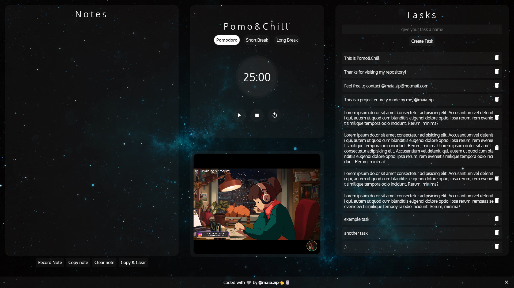

<h1 align="center">Pomo&Chill</h1>

Boost your productivity with Pomo&Chill!

<a href="#project">Project</a>&nbsp;&nbsp;&nbsp;|&nbsp;&nbsp;
<a href="#technologies">Technologies</a>&nbsp;&nbsp;&nbsp;|&nbsp;&nbsp;
<a href="#contact">Contact</a>

[Access Link](https://maiazip.github.io/Pomo-Chill/)

## Project
This project is called Pomo&Chill and consists of a website focused on helping users improve their focus and discipline, in order to obtain more results in their activities, being useful in study, work and even creativity.

The objective of the project is to provide results through the science found in some popular study techniques, and that is why the site contains the following features:

Notes: The notes field is used to make notes on the desired subject, and these notes can be made through audio, with the help of the Audio Recognition Api, which transcribes your speeches into text, or through standard typing, allowing the user to use this field to consolidate your learning, as well as in the Feynman technique, which consists of teaching the subject learned, through texts and speech.

Pomodoro Timer: This timer uses the pomodoro method, which consists of defining a time in which you will fully dedicate your focus to an activity, with a set of programmed intervals that vary depending on the number of times you have performed the method, allowing for greater focus and avoiding exhaustion.

LoFi music player: This functionality consists of using the Losanov technique, which consists of using ambient music at 60 to 70 BPM, creating a more relaxing study environment, and activating the creative zone of our brain, providing better results without disturbing in focus.

Creating tasks: The function of tasks is to define objectives to be achieved during your time in focus, allowing you to organize yourself by defining goals to be achieved during your activity.

All of this together forms Pomo&Chill.

## Technologies

- HTML
- CSS
- JavaScript
- Git
- Github

## Contact

maia.zip@hotmail.com